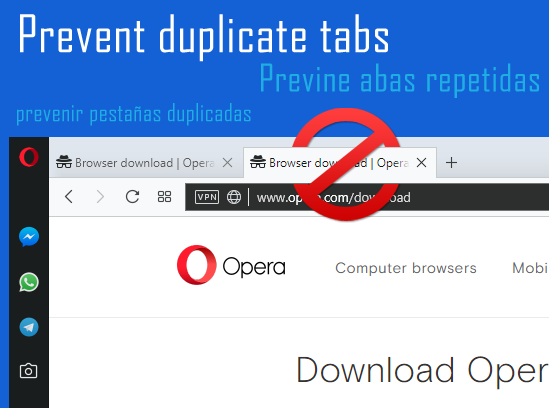

## About

Prevents from automatically creating new tabs or repeating tabs when two or more tabs have the same addresses

The process of closing repeated tabs is automatic based on settings that you can determine within the extension/add-on, it is also possible to quickly disable and activate the add-on without having to access the extensions panel.

You can add a host or URL to specify as an exception so that the extension/add-on does not close repeated tabs.

The extension/add-on has support for closing repeated tabs in incognito/anonymous mode, but this works in isolation and will not share any information in anonymous mode with normal mode, being completely separate actions.

Among the configurations you can choose to consider or disregard querystring and hashes in URLs as a factor to differentiate them.

## Supported browsers

- Chrome 30+
- Firefox 48+
- Edge (Chromium)
- Opera 40+

## Install

- [Chrome](https://chrome.google.com/webstore/detail/prevent-duplicate-tabs/eednccpckdkpojaiemedoejdngappaag)
- [Firefox](https://addons.mozilla.org/firefox/addon/smart-prevent-duplicate-tabs/)
- [Edge](https://microsoftedge.microsoft.com/addons/detail/prevent-duplicate-tabs/iijplllphnkkeepcinimpjobncicbbmb)
- [Opera](https://addons.opera.com/en/extensions/details/prevent-duplicate-tabs/)

## Configs

### Sort order

It is also possible to configure whether you prefer to close the oldest tabs and whether you want to prevent the active tab (currently visible) from being closed:

Configuration | Description
--- | ---
`close olders` | Close the old tabs and keep the most recent one with the same URL
`keep the tab that is active` | Don't close active tabs. If disabled, when the active tab is closed, the browser will switch to the old tab

### URLs

Configuration | Description
--- | ---
`only http` | Close only tabs with HTTP(s) urls
`querystring` | If disabled (off) it's ignore querystring in URLs, then this `http://foo/bar?baz` will be equivalent to this `http://foo/bar`
`hash` | If disabled (off) it's ignore hash in URLs, then this `http://foo/bar#baz` will be equivalent to this `http://foo/bar`

### Others

Configuration | Description
--- | ---
`incognito` | Check repeated anonymous tabs (requires you to manually enable in your browser)
`windows` | Close only repeated tabs from the same window (recommended)
`containers` | If enabled it will ignore repeated tabs in different containers, treating them as if they were non-repeated tabs (recommended), only Firefox

### Events

The closing of the tabs works based on events from the Chrome API and you can disable or reactivate such events within the extension/add-on:

Event | Description
--- | ---
`start` | Close repeated tabs when your browser is launched
`update` | Close repeated tabs when a tab is updated, more details in [`tabs.onUpdated.addListener`](https://developer.chrome.com/extensions/tabs#event-onUpdated)
`create` | Close repeated tabs when a new tab is created, more details in [`tabs.onCreated.addListener`](https://developer.chrome.com/extensions/tabs#event-onCreated)
`replace` | Close repeated tabs when a tab is replaced with another tab due to prerendering or instant, more details in [`tabs.onReplaced.addListener`](https://developer.chrome.com/extensions/tabs#event-onReplaced)
`attach` | Close repeated tabs when a tab is attached to another window or detached (creating a new window), more details in [`tabs.onReplaced.addListener`](https://developer.chrome.com/extensions/tabs#event-onAttached)
`datachange` | Close repeated tabs when you change `sort order`, `URLs`, `others` and `events` configurations from extension

## Languages

Supported languages:

- [Chinese (zh)](chrome/_locales/zh/messages.json)
- [English (en)](chrome/_locales/en/messages.json)
- [French (fr)](chrome/_locales/fr/messages.json)
- [German (de)](chrome/_locales/de/messages.json)
- [Japanese (ja)](chrome/_locales/ja/messages.json)
- [Korean (ko)](chrome/_locales/ko/messages.json)
- [Portuguese (pt)](chrome/_locales/pt/messages.json) (and [Brazilian Portuguese (pt_BR)](chrome/_locales/pt_BR/messages.json))
- [Spanish (es)](chrome/_locales/es/messages.json)

I used automatic translations to generate the texts (`messages.json`), so there may be errors, the project is open-source, so feel free to send a pull-request with corrections in the translations.
